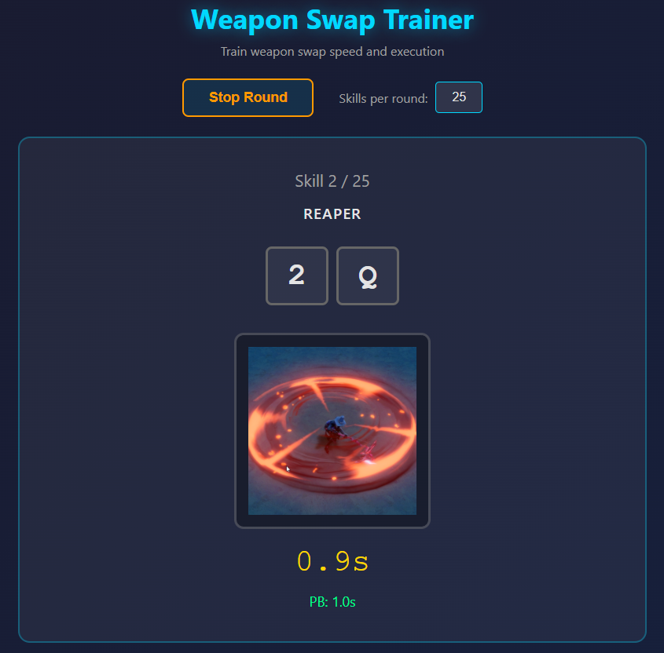
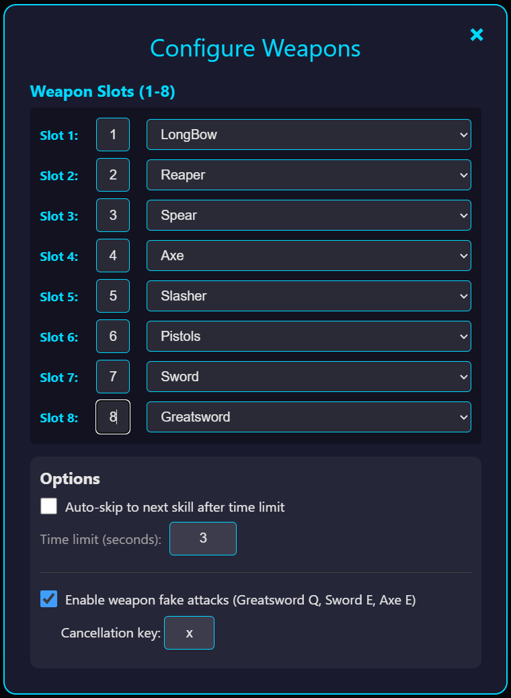

# Weapon Swap Trainer

A V Rising weapon swap training application to help improve your weapon skill execution speed and build muscle memory.

## Screenshots

### Training Mode
Practice weapon skills with visual feedback and real-time performance tracking.

### Weapon Configuration
Easily configure your weapon loadout for slots 1-8.

## Features

- **Training Mode**: Practice random weapon skills with real-time feedback
- **Personal Bests**: Track your best time for each weapon skill
- **Statistics**: View average, fastest, and slowest times after each round
- **Weapon Selection**: Configure which weapons are in slots 1-8
- **Custom Keybindings**: Match your in-game weapon slot keybindings (e.g., F, R, V instead of 1, 2, 3)
- **Auto-Skip Option**: Automatically advance to the next skill after a time limit
- **Progress Tracking**: See your times during the round and track improvements
- **Weapon Fake Attacks**: Practice cancellation mechanics for advanced PvP techniques

## Getting Started

### Quick Start
1. Download or clone this repository
2. Open `index.html` in any modern web browser
3. Click "Start Round" to begin training
4. Press the displayed key combinations as they appear on screen

That's it! No installation or build process needed.

## How to Use

### Training
1. Click **"Start Round"** to begin
2. A 3-second countdown will appear
3. Press the key sequence shown (e.g., press `1` for the weapon slot, then `Q` for the skill)
4. Complete all weapon skills in the round
5. View your results and personal bests

### Configuring Weapons

Click the **"Configure"** button to set up your weapon slots:

#### Weapon Slots (1-8)
- Select which weapon you want in each slot (1-8)
- **Customize slot keybindings** to match your in-game bindings (default: 1-8)
  - Click the key input box next to each slot to set a custom key
  - Example: Change slot 1 from "1" to "F" if you use F for your first weapon slot
- Each weapon has two skills: Q and E
- During training, you'll practice random weapon skills based on your configuration
- Available weapons:
  - Spear, Slasher, Axe, Mace, Sword, Crossbow, Greatsword, Whip
  - LongBow, Dagger, Claw, TwinBlade, Pistols, Reaper

### Settings

- **Skills per round**: Choose how many weapon skills to practice (1-9999)
- **Auto-skip**: Enable automatic advancement after a time limit (adjustable from 0.1 to 10 seconds)

### Custom Keybindings

The trainer supports **custom keybindings for weapon slots** to match your in-game setup:

#### Why Custom Keybindings?
Many players use custom keybindings instead of the default 1-8 for weapon slots. For example:
- Using `F`, `R`, `V`, etc. for easier reach
- Using mouse buttons or other keys for comfort
- Matching specific PvP layouts

#### How to Set Up
1. Go to **Configure** → **Weapon Slots**
2. For each slot, you'll see a small input box before the weapon dropdown
3. Click the box and type your custom key (e.g., change "1" to "F")
4. The trainer will now show and accept your custom keys during training

#### Example
If you bind slot 1 to "F" and select Greatsword, the trainer will display "F" + "Q" instead of "1" + "Q" when training Greatsword Q.

### Weapon Fake Attacks

Enable **Weapon Fake Attacks** in the Options section to practice advanced cancellation mechanics:

#### What are Fake Attacks?
Fake attacks simulate cancelling weapon abilities mid-cast to bait enemy reactions. In training, you'll practice the weapon skill followed by a cancellation key press.

#### Supported Fake Attacks
- **Greatsword Q** (Slot + Q + Cancel Key)
- **Sword E** (Slot + E + Cancel Key)
- **Axe E** (Slot + E + Cancel Key)

#### Configuration
1. Enable the **"Enable weapon fake attacks"** checkbox
2. Set your **Cancellation Key** (default: `x`)
   - This is the key you'll press after the weapon skill to simulate the cancel

#### During Training
- Fake attacks appear with **"Fake Attack"** in yellow text
- A red **"FAKE"** overlay appears on the skill image
- You'll see three keys to press: **Slot Number → Skill Key → Cancellation Key**
- Example: For Greatsword fake - press `8`, then `Q`, then `X`
- Personal bests are tracked separately for normal attacks vs fake attacks

## Key Features Explained

### Personal Bests
The app automatically tracks your fastest time for each weapon skill. When you beat a personal best, you'll see a ★ indicator and "NEW PB!" message.

### Round Statistics
After each round, view:
- **Average Time**: Your mean completion time
- **Fastest**: Your quickest skill
- **Slowest**: Your slowest skill
- **New PBs**: How many personal bests you achieved

### Error Tracking
If you press the wrong key, the indicators will flash red and reset. Errors are counted but don't stop your progress.

## Keyboard Shortcuts

- **Any Key**: Use during training to execute weapon skills
- **Escape**: Close open modals

## Default Weapon Configuration

On first run, the app loads with these default weapons in slots 1-8:
1. LongBow
2. Reaper
3. Spear
4. Axe
5. Slasher
6. Pistols
7. Sword
8. Greatsword

You can customize these at any time through the Configure menu.

## Data Storage

All your data is saved locally in your browser:
- Your weapon slot configuration
- All personal best times
- Your preferences (round size, auto-skip settings)

**Note**: Clearing your browser data will reset everything.

## Browser Compatibility

Works in all modern browsers:
- Chrome
- Firefox
- Safari
- Edge

## Tips for Best Results

1. **Start with smaller rounds** (5-10 skills) to build consistency
2. **Use auto-skip** to maintain rhythm and prevent overthinking
3. **Focus on accuracy first**, then speed
4. **Track your progress** by reviewing your personal bests regularly

## Support

If you encounter any issues or have suggestions, please open an issue on GitHub.

---

Happy training!
